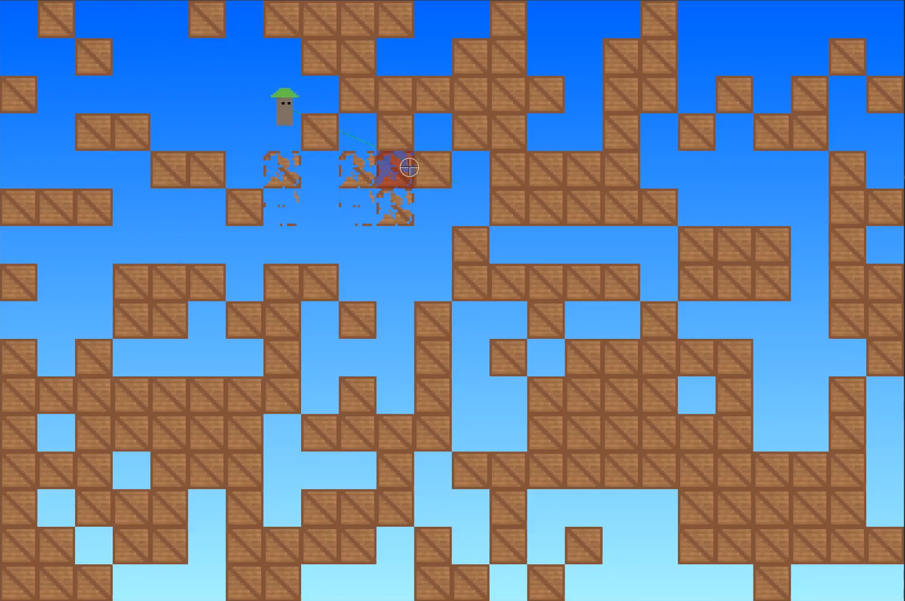
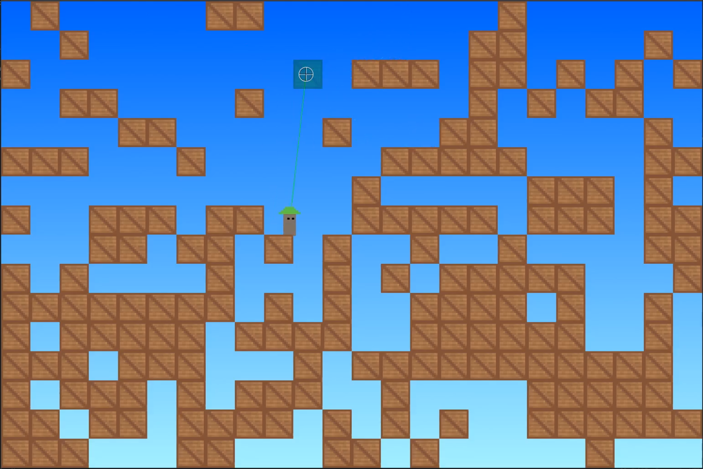

# [WIP] Blocky Shooter

## Compilation
### Requirements
+ gcc
+ make
+ cmake
+ libsdl2-dev

Install them on Debian:
`sudo apt install gcc make cmake libsdl2-dev`

### How to
+ Clone the repo
+ `cd` to its directory
+ `mkdir build`
+ `cd build`
+ `cmake ..`
+ `make`
+ Execute it: `./blocky-shooter`

## Playing
+ `A`: left
+ `D`: right
+ `Space`: jump
+ `Mouse motion`: change pistol angle
+ `Left mouse`: shoot
+ `Right mouse`: place crate
+ `Escape`: exit

## License
Licensed under the 2-Clause BSD License.
See the file: LICENSE